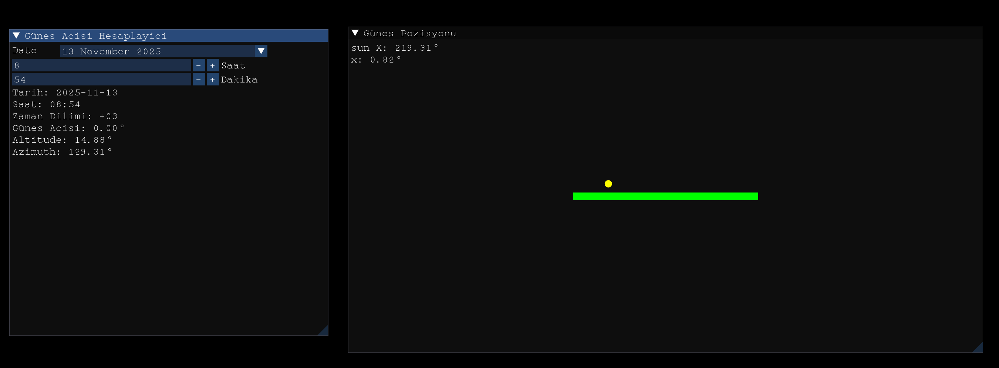

# Vakit

A highly precise, C++ graphical application designed for calculating and visualizing the Sun's position and related astronomical data in real-time. It leverages the official IAU SOFA (Standards of Fundamental Astronomy) C library to perform rigorous astronomical computations.

## Features

* **High-Precision Astronomy:** Utilizes the robust `sofa_c` library (included in the repository) to accurately compute solar positions, Julian dates, and fundamental astronomical algorithms.
* **Real-Time Graphical Interface:** Built with Dear ImGui, GLFW, and OpenGL, providing a fast, lightweight, and responsive dashboard.
* **Custom Typography:** Integrated with a custom monospace font (`monospace.medium.ttf`) for clean and readable data presentation.
* **Nix Environment:** Comes with a `shell.nix` file, ensuring a fully reproducible development environment without the hassle of manual system library configuration.

## Screenshot



## Prerequisites

If you are running NixOS or have the Nix package manager installed, no manual dependency installation is required. Otherwise, ensure you have the following installed:

* A C++11 compatible compiler (e.g., `g++`)
* `make`
* GLFW 3 (`libglfw3-dev`)
* GLEW (`libglew-dev`)
* OpenGL libraries (`libgl1-mesa-dev`)

## Build and Installation

1. Navigate to the project directory.
2. (Optional) If you use Nix, drop into the development shell to automatically load all required dependencies:

```bash
   nix-shell

```

3. Compile the application using the provided Makefile. The build process will link against the included SOFA library and the system's GLFW/OpenGL libraries:

```bash
make

```

## Usage

Once compiled, an executable will be generated. Simply run the executable from your terminal to launch the interface:

```bash
./vakit

```
